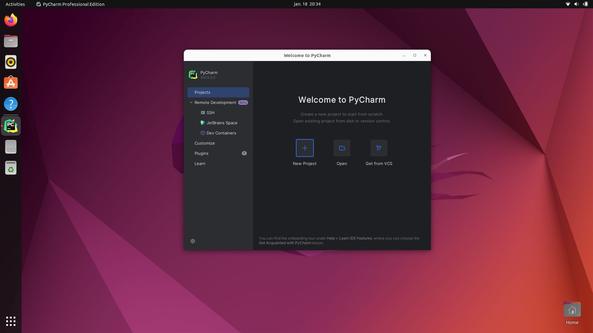
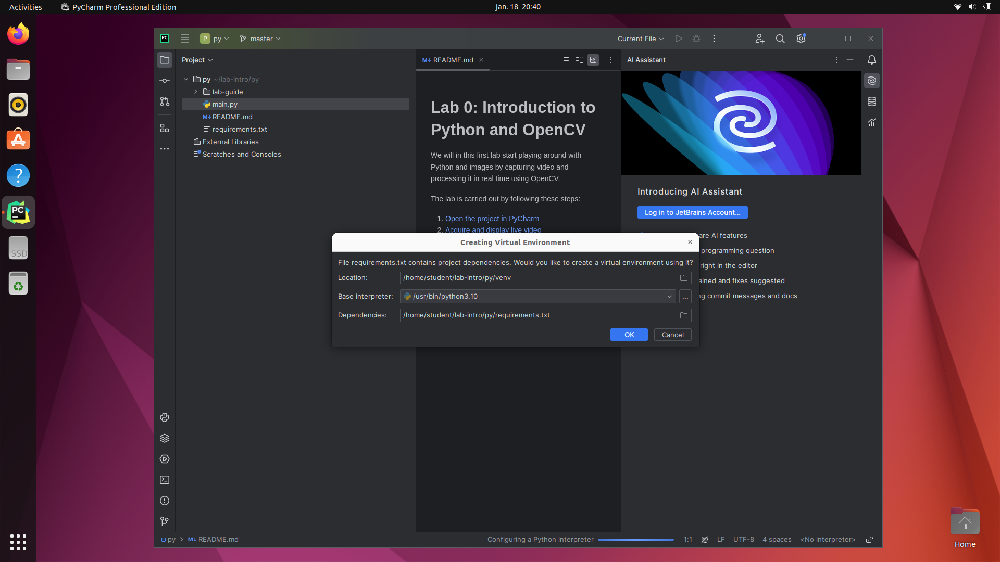

# Step 1: Open the project in PyCharm
We will in this part download the code from the course repository, and open the project in PyCharm.

## 0. Make sure that we have python3.8 installed
`python3.8` is the newest version of python we can get in Ubuntu 18.04 without any extra effort.

Make sure we are up to speed
```bash
sudo apt update
sudo apt install python3.8 python3.8-dev python3.8-distutils python3.8-venv
```

## 1. Clone the code
Clone this repository on your machine.
The lab machines have a directory `labs` under the home directory.
We can clone the lab under this directory by typing the following in the terminal:
```
cd ~/labs
git clone https://github.com/tek5030/lab_00.git
cd lab_00
```
You should now find the code and this lab guide in `~/labs/lab_00`.
The C++ version is in the subfolder called `cpp`,
and the Python version in the subfolder called `py`. 

## 2. Open PyCharm
We will use PyCharm as IDE in the labs.
As a student, you can get it for free from [https://www.jetbrains.com/pycharm](https://www.jetbrains.com/pycharm).


Open PyCharm.

## 3. Choose "Open project"


## 4. Find and open the lab project
Open the `py` folder in the lab directory.

PyCharm should discover our `requirements.txt` and offer to create a virtual environment based on our python3.8 interpreter. Press OK.




## 5. We are ready to do some programming!


We are now ready to continue to [the next step](2-acquire-and-display-live-video.md).
